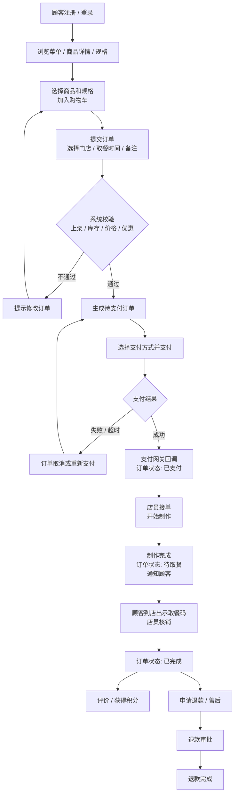

# week1：校园咖啡店线上点单自取系统 —— 项目设计

> **场景定位**：校园咖啡店线上点单自取系统。顾客在线下单，到店取餐，店员制作核销。该场景能覆盖「顾客到完成交易」的主要环节，也方便后续做权限设计。

---

## 一、业务流程：从顾客到完成交易

### 1. 文字流程

1. 顾客注册 / 登录。
2. 顾客浏览菜单、商品详情、规格。
3. 顾客选择商品和规格，加入购物车。
4. 顾客提交订单：选择门店、取餐时间、备注。
5. 系统校验商品是否上架、库存是否充足、价格和优惠是否有效。
6. 校验通过，生成待支付订单；不通过则提示修改。
7. 顾客选择支付方式并支付。
8. 支付成功，支付网关回调系统，订单状态变为「已支付」。
9. 店员接单，开始制作。
10. 制作完成，订单状态变为「待取餐」，通知顾客。
11. 顾客到店，出示取餐码，店员核销。
12. 订单状态变为「已完成」。
13. 顾客可评价、获得积分；如有问题可申请退款或售后。

> **异常分支**：支付失败、超时未支付、顾客取消、库存不足、退款。

### 2. Mermaid 流程图

---

## 二、角色与职能清单

| 角色 | 主要职责 | 后续权限设计提示 |
| --- | --- | --- |
| 顾客（会员） | 注册登录、浏览商品、加购、下单、支付、查看自己的订单、取消订单、评价、申请退款、查看积分、使用积分 | 只能看和操作自己的数据；不能改价格、库存、他人订单 |
| 店员 | 查看订单、接单、制作、更新订单状态、核销取餐码、反馈缺货 | 可读当日订单；可改订单状态；不能改价格、不能审批退款 |
| 店长 | 管理商品、价格、库存、优惠活动、店员排班、查看报表、审批退款 | 可管理商品/库存/优惠；可审批退款；不能改系统权限 |
| 系统管理员 | 管理账号、角色、权限、系统配置、日志审计、备份恢复、支付渠道配置 | 可管权限和配置；业务数据应脱敏；不能随意改交易金额 |
| 支付网关 | 处理支付、返回支付结果 | 外部系统；只接收订单号和金额，返回交易号、状态 |
| 客服/售后（可选） | 处理退款、投诉、异常订单 | 只能看相关订单；退款需店长或管理员审批 |

> **核心思路**：顾客只看自己，店员管履约，店长管经营，管理员管系统，支付网关管钱。
>
> **会员说明**：会员 = 已注册的顾客，不单独设角色；会员权益体现在「积分余额」与「积分流水」上。
>
> 后面做权限时可以用 **RBAC**：用户 → 角色 → 权限。

---

## 三、数据边界清单：进库 / 不进库

数据边界不是「所有数据都进数据库」，而是按**持久化需求、安全合规、事务一致性、性能**来划分。

### 1. 建议进数据库的数据

| 数据项 | 是否进库 | 理由 |
| --- | --- | --- |
| 用户账号：用户名、邮箱/手机号、密码哈希、状态、会员积分余额 | 进库 | 登录鉴权、身份识别、权限关联；会员=已注册顾客，积分余额随账号存 |
| 角色与权限：角色、权限、用户角色关系 | 进库 | 后续 RBAC 权限控制的基础 |
| 商品分类、商品、SKU、规格 | 进库 | 交易基础数据，需要查询和上下架 |
| 商品价格、上下架状态 | 进库 | 下单计价、订单快照需要 |
| 门店信息、员工信息 | 进库 | 多门店管理和订单归属 |
| 库存：SKU、门店、数量 | 进库 | 防超卖，需要事务一致性 |
| 订单、订单明细 | 进库 | 交易凭证、查询、对账、售后 |
| 订单商品快照：名称、单价、数量 | 进库 | 防止商品改价后历史订单变化 |
| 支付记录：支付单号、订单号、渠道交易号、金额、状态 | 进库 | 对账和状态追踪，但不存卡号 |
| 优惠券、活动、领取记录 | 进库 | 营销结算和风控 |
| 取餐码、核销记录 | 进库 | 履约凭证，防止重复取餐 |
| 评价：评分、内容、订单关联 | 进库 | 反馈和展示 |
| 积分流水：用户、变动类型（消费/评价获得/兑换）、变动分值、余额、时间、关联订单 | 进库 | 审计积分来源与消费，防止篡改，便于对账 |
| 操作日志：操作人、动作、对象、时间 | 进库 | 审计和追责 |

### 2. 不建议进数据库的数据

| 数据项 | 是否进库 | 存放建议 | 理由 |
| --- | --- | --- | --- |
| 明文密码 | 不进库 | 只存哈希 + 盐 | 安全，防泄露 |
| 完整银行卡号、CVV、有效期、支付密码 | 不进库 | 支付网关处理 | PCI 合规，敏感支付信息不应由业务库保存 |
| 身份证照片、人脸生物特征 | 不进库 | 对象存储/第三方，只存引用 | 敏感隐私，最小必要原则 |
| 短信/邮箱验证码 | 不进库 | Redis 短期缓存 | 临时、高频、自动过期 |
| 游客购物车 | 可不进主库 | 本地存储或 Redis | 临时数据，不一定要长期持久化 |
| 商品图片、视频原文件 | 不进库 | 对象存储，只存 URL | 数据库不适合大文件，性能差 |
| 调试日志、访问日志原文 | 不进主库 | 日志系统/ELK | 体积大，查询模式不同 |
| 第三方 access token 明文 | 不进库 | 加密存储或只存引用 | 安全风险 |
| 用户行为埋点原始流 | 不进业务库 | 数据仓库/分析平台 | 分析用，不影响交易一致性 |

### 3. 划分原则

- **要事务一致的进库**：订单、库存、支付状态。
- **要长期查询和审计的进库**：订单、日志、评价。
- **敏感支付信息不进业务库**：交给支付网关。
- **大文件不进库**：放对象存储，只存 URL。
- **临时高频数据不进主库**：验证码、游客购物车放 Redis。
- **密码只存哈希**：绝不存明文。

---

## 四、作业提交思路

**场景**：校园咖啡店线上点单自取系统。

- **业务流程**：用文字 + Mermaid 图，覆盖注册、浏览、下单、支付、接单、制作、取餐、完成、售后。
- **角色清单**：顾客、店员、店长、系统管理员、支付网关。每个角色写职责，并标注权限设计方向。
- **数据边界**：分「进库」和「不进库」两张表，每项写理由。
- **衔接权限**：用 RBAC 做角色权限矩阵，例如顾客只能看自己订单，店员只能改状态，店长能改价格和审批退款，管理员管权限和配置。

> 这样三个任务都能覆盖，而且后面做数据库表设计和权限设计时，逻辑是连贯的。
